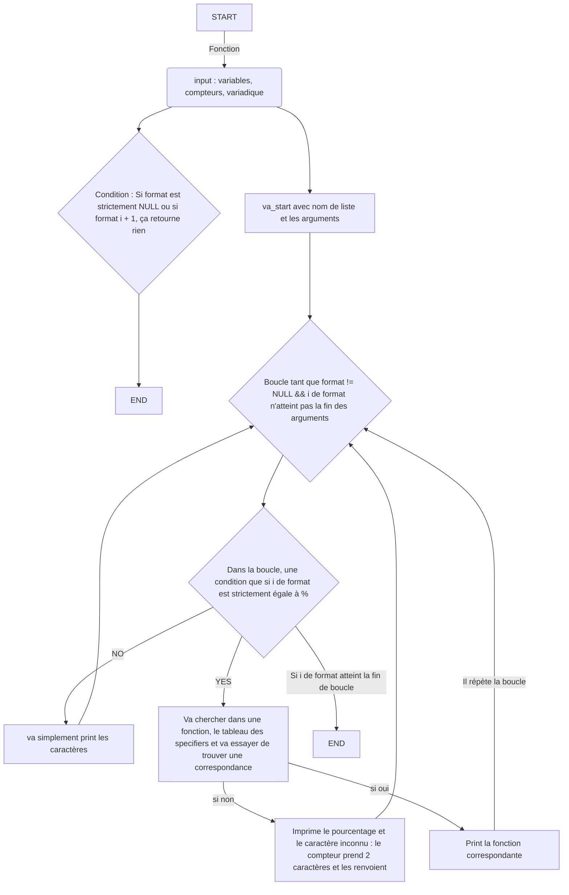

# 🖨️ Projet Printf 🖨️

## 📄 Description 📄

Le projet `Printf` consiste à recréer la fonction standard `printf` en langage C.
Cette fonction permet d'afficher des `chaînes de caractères` avec des `spécificateurs de format`, permettant d'afficher des données de différents types comme des entiers, des chaînes, des flottants, etc. Un seul repository pour ce projet en ajoutant un collaborateur pour travailler à deux. Souvent, un pc a été utilisé pour le projet (peers programming).

---
## 📊 Flowchart 📊


---

## 💻 Commande de Compilation 💻

```bash
$ gcc -Wall -Werror -Wextra -pedantic -std=gnu89 -Wno-format *.c
```

## 📋 Requirements 📋

Langage de programmation : C

Compilateur : GCC

Conformité aux normes : C89

Pas d'utilisation de bibliothèques externes autres que celles standards !

Respect des contraintes de performance et d'optimisation mémoire

Un seul repository pour le projet

## 📜 Exemple d'utilisation de la fonction _printf 📜

Voici un exemple d'utilisation de la fonction _printf :

Exemple 1 : Affichage d'une chaîne de caractères
```bash
_printf("Hello, World!\n");
```

Sortie en STDOUT :
```bash
Hello, World!
```

## 📚 Man Page 📚

Vous pouvez consulter la man page de la fonction _printf en exécutant la commande suivante :

```man ./man_3_printf.man```

## 🧠 Valgrind 🧠

Test mémoire tampon.
Commande :
```bash
valgrind ./a.out
```

Résultat :

```bash
==82196== Memcheck, a memory error detector
==82196== Copyright (C) 2002-2022, and GNU GPL'd, by Julian Seward et al.
==82196== Using Valgrind-3.22.0 and LibVEX; rerun with -h for copyright info
==82196== Command: ./a.out
==82196==
Let's try to printf a simple sentence.
Let's try to printf a simple sentence.
Length:[39, 39]
Length:[39, 39]
Negative:[-762534]
Negative:[-762534]
Unsigned:[2147484671]
Unsigned:[2147484671]
Unsigned octal:[20000001777]
Unsigned octal:[20000001777]
Unsigned hexadecimal:[%x, %X]
Unsigned hexadecimal:[800003ff, 800003FF]
Character:[H]
Character:[H]
String:[I am a string !]
String:[I am a string !]
Address:[%p]
Address:[0x7ffe637541f0]
Percent:[%]
Percent:[%]
Len:[12]
Len:[12]
Unknown:[%r]
Unknown:[%r]
-2147483648
1024
2000
%x
%X
==82196==
==82196== HEAP SUMMARY:
==82196==     in use at exit: 0 bytes in 0 blocks
==82196==   total heap usage: 1 allocs, 1 frees, 1,024 bytes allocated
==82196==
==82196== All heap blocks were freed -- no leaks are possible
==82196==
==82196== For lists of detected and suppressed errors, rerun with: -s
==82196== ERROR SUMMARY: 0 errors from 0 contexts (suppressed: 0 from 0)
```

Aucune fuite mémoire detectée.

## 🎯 Auteurs 🎯

- 👨‍💻 : **Lefoulon Thérèse-Marie** – [GitHub](https://github.com/Timi-Holberton)

- 👨‍💻 : **Roche Samira** – [GitHub](https://github.com/StrawberSam)

